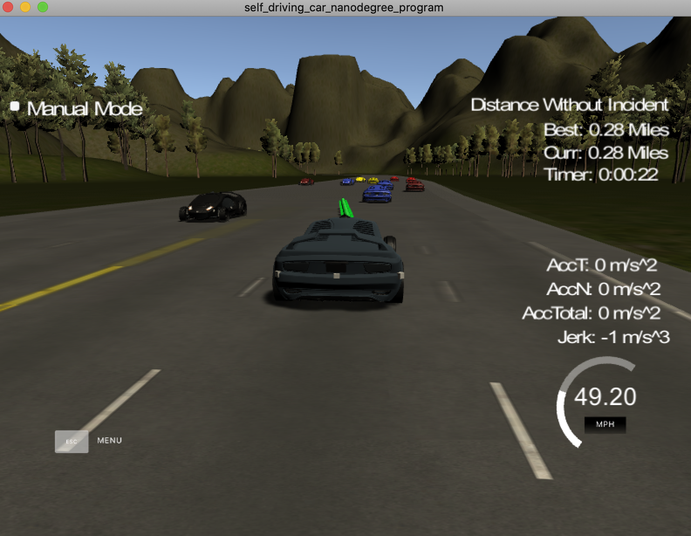

# Self-driving Car Simulation

This project is adapted from Udacity's Car path planning project.
https://github.com/udacity/CarND-Path-Planning-Project

This project implements trajectory planning and generation using C++. Lane decision making and behavioural planning is governed by a cost function. The logic can be found in the main.cpp folder (Autonomous-Vehicle-Project/src).

## Cost Function Logic

For each of the cars in the simulation, determine their lane. Using a cost function with a cost for each lane (3 costs, total), check 4 conditions and modify the cost of each lane. Increase the cost if there is a car ahead in the lane. Increase the cost of a lane if there is a car beside the ego car. Increase the cost of changing to a lane by a large number if it is more than one lane away. Finally, decrease the cost of the ego car’s current lane. Find the lowest cost, set this as the target lane, and change to that lane using the trajectory planning. Using a Boolean array, check if the ego should slow down or speed up based on if there is a car ahead in its lane and whether the car is at the maximum speed.

## Simulation 

Car changing lane.

